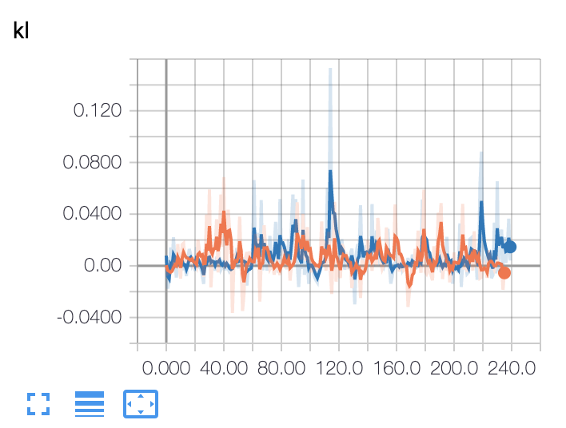

# Generative Adversarial Imitation Learning

## Gym environment

* Env==CartPole-v0
* State==Continuous
* Action==Discrete

## Generate expert data

Generate expert data by ppo

```
python get_expert_data.py
```

## Imitation Learning

```
python main.py
```

## Result

* orange : gail
* blue : ppo

<div align="center">
  
  
</div>

<div align="center">
  
  
</div>

## Reference

[1] [Generative Adversarial Imitation Learning](https://papers.nips.cc/paper/6391-generative-adversarial-imitation-learning.pdf)
